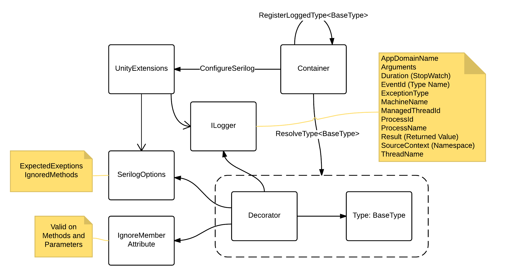

# Unity.Interception.Serilog

Types which are registered to the Unity Container with the `RegisterLoggedType` method are decorated with a logging behavior. The logs which are produced contains information about the respective types method invocations such as execution time, arguments and result, and are persisted though the Serilog ILogger-adapter.

In addition, all logging through the configured ILogger instance are enriched with properties describing the environment where the logging event occurred.



*Overview of Unity.Interception.Serilog*

## Install

To install Unity.Interception.Serilog, run the following command in the Package Manager Console:

```
Install-Package Unity.Interception.Serilog -Pre
```

## Configuration

The logging is set up by calling the `ConfigureSerilog` extension method on a container, and either pass in a `LoggerConfiguration` instance or use the overload with an action `Action` parameter where the `LoggerConfiguration` is created for you.

The `ConfigureSerilog` method registers an `ILogger` instance in the container, so it's important that the `LoggerConfiguration` is configured before.

Thrown exceptions are logged as errors by default, but it is possible to configure a list of expected exceptions which are then logged as information instead.

It is also possible to ignore methods from being logged at all, by passing a list of `MethodIdentifier`s.

```charp
using Unity.Interception.Serilog;
...
var container = new UnityContainer();
var expectedExceptions = new[] {typeof (InvalidOperationException)};
var ignoredMethods = new[] { new MethodIdentifier(typeof(IMyType), nameof(IMyType.DoStuff)) };
container
    .ConfigureSerilog(c => c.WriteTo.Xyz(...), expectedExceptions, ignoredMethods);
``` 

In this example, the configuration of Serilog is made through `c.WriteTo.Xyz(...)` and has to be replaced with the sink that you would like to use. For example with `Serilog.Sinks.Elasticsearch` the configuration could be done by `c.WriteTo.Elasticsearch("http://localhost:9200", "myindex-{0:yyyy.MM.dd}")`.

It is optional whether to pass the parameters `expectedExceptions` and `ignoredMethods` or not.

As an alternative to configure ignored methods though `ConfigureSerilog`, you can use the `IgnoreMember` attribute. It is applicable to not only methods, but parameters as well.

```charp
using Unity.Interception.Customization;
...
public interface IMyType
{
    [IgnoreMember]
    void DoSecretStuff();

    void DoStuffWithSecretParameter(string username, [IgnoreMember] string password);
}

```

### Type Registration

To enable logging for a certain type use one of the extension methods:

```charp
using Unity.Interception.Serilog;
...
var container = new UnityContainer();
...
container
    .RegisterLoggedType<IMyType, MyType>();
    .RegisterLoggedInstance<IMyType>(new MyType());
```
## Logging

All logs that is made through the `ILogger` that is registered in the container are enriched with the properties that are mentioned in [CommonProperties.cs](src/Unity.Interception.Serilog/CommonProperties.cs).

### Trace Logs

Except from the common properties, the following is also logged for trace logs:

* `SourceContext`: Namespace and och type name
* `EventId`: Method name.
* `Arguments`: A list of argument names and values.
* `Result`: The result, if the method produces such a thing.
* `Duration`: The execution time in ms.
* `LogType`: Is set to `Trace`. This is nice to have to distinguish trace logs from for example event logs.

Due to performance reasons, arguments and results are not serialized as objects, but captured with `ToString()`.

The properties `Exception` och `ExceptionType` are included for logs for thrown exceptions. 

### Event Logs

There is no built in support for formating event logs like the trace logs. You will have to write your own helper for that. For example:

```charp
public static void Information<T>(
    this ILogger logger, string eventId,
    string messageTemplate, params object[] propertyValues)
{
    messageTemplate = "[{SourceContext}.{EventId}] " + messageTemplate;
    logger
        .ForContext<T>()
        .ForContext("EventId", eventId)
        .ForContext("LogType", "Event")
        .Information(messageTemplate, propertyValues);
}
```

### Serilog.Sinks.MSSqlServer Example

There is a `TraceLog` helper class that is useful together with the SQL Server sink. For example, you could configure Serilog like so:

```charp
var columnOptions = new ColumnOptions { AdditionalDataColumns = TraceLog.DataColumns };
columnOptions.Properties.ExcludeAdditionalProperties = true;
var container = new UnityContainer()
    .ConfigureSerilog(c => c.WriteTo.MSSqlServer(
        "Server=.;Database=SerilogTest;Trusted_Connection=True;", "Log",
        autoCreateSqlTable: true, columnOptions: columnOptions));
```

## Links

* [Serilog Wiki](https://github.com/serilog/serilog/wiki/Getting-Started)
* [Patterns & Practices - Unity.Interception](https://msdn.microsoft.com/en-us/library/dn178466.aspx)

